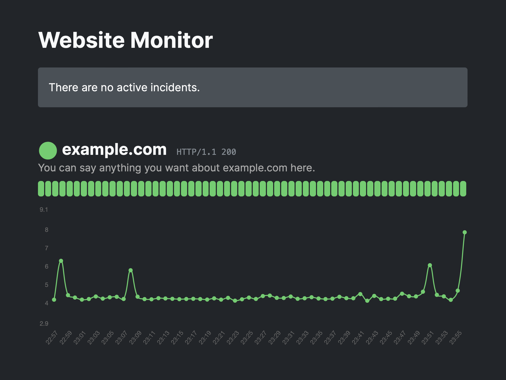

# Website Monitor

This is a simple website monitor, inspired by [broke.lol](https://broke.lol).



## Usage

Upload everything to your web server (except the `screen.png` file, which isn’t needed). Make sure that PHP has permission to write to the `monitors` directory (this is where monitor data is stored).

Open `monitors.json` and add whatever websites you’d like you monitor. The format is a key-value pair, with the key being the “display name” of the website, and the value being the URL that will be checked. For example:

```
{
	"example.com": "https:\/\/example.com",
	"wikipedia.org": "https:\/\/www.wikipedia.org"
}
```

To automate your monitoring, you can add something like this to your crontab:

```
* * * * * /usr/bin/php -f /path/to/monitor.php >/dev/null 2>&1
```

You can display a specific message for each monitored resource by creating a Markdown file in the `updates` directory that uses the same display name for the resource (and has a `.md` extension). For example, if you want to display some text near the `example.com` resource, you’d add a file called `example.com.md` within the `updates` directory.

You can display various incident messages by placing a Markdown file in the `incidents` directory. By default, any file there will be treated as an informational message (shown in gray). If you prepend `alert_` in the file name, the message will be treated as an alert (shown in red). And if you prepend `notice_`, it’ll be treated as a notice (shown in yellow).

This project uses [Parsedown](https://parsedown.org), a truly excellent Markdown rendering tool.